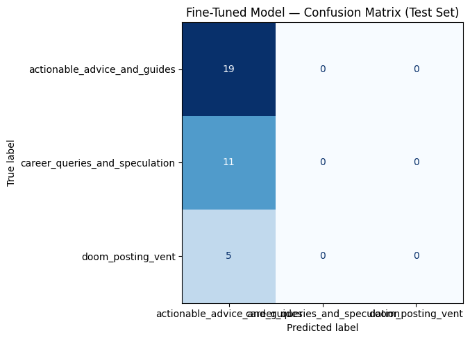

# TakeMeter Project Specification: r/cscareerquestions

## 1. Chosen Community & Justification
* **Community:** `r/cscareerquestions` (https://www.reddit.com/r/cscareerquestions/)
* **Description:** This subreddit is an online forum where students, entry-level engineers, and tech veterans discuss job hunting, computer science curriculum, interview prep (like LeetCode), and industry trends.
* **Why it's a great fit:** The discourse quality varies wildly. It contains structural sharing of career histories and actionable strategies from industry professionals, alongside general industry speculation or expressions of intense professional fatigue, anxiety, and sudden market disruptions. This clear structural contrast makes it an ideal text classification task.
* **Why these distinctions matter to the community:** Regular users and students browsing `r/cscareerquestions` face immense information fatigue and anxiety. Classifying text by its structural presentation allows the community to separate professional burnout and stress logs (`doom_posting_vent`) or general hypothetical chatter (`career_queries_and_speculation`) from concrete, real-world professional guidance and experience checklists (`actionable_advice_and_guides`).

## 2. The 3-Label Taxonomy
We classify posts by their primary structural intent rather than how universally "helpful" they are:

* **`actionable_advice_and_guides`**: The post shares concrete, actionable strategies, professional experiences, resume breakdowns, or systematic interview prep advice derived from real-world execution.
    * *Example 1:* "I applied to 250 companies, got 4 interviews, and landed 1 offer. Here is the resume format and the exact LeetCode modules I focused on."
    * *Example 2:* "I've been a Lead SWE for 8 years. When reviewing portfolios, here are the three exact architecture mistakes that make me instantly reject a candidate's GitHub."
    * *Uncertain Post:* "I got a 60% on my data structures midterm, what steps should I take next?" 
    * *Decision:* Classify as `career_queries_and_speculation`. While it asks for a roadmap, the post itself is an open personal dilemma seeking input, rather than providing a structured guide or professional breakdown.
* **`career_queries_and_speculation`**: Open-ended questions, personal dilemmas, hypothetical industry predictions, or discussions about tech trends and workplace culture stated without a structured, actionable guide or framework.
    * *Example 1:* "Do you guys think remote work is going to completely disappear in the next 5 years, or will hybrid become the permanent standard?"
    * *Example 2:* "Is it better to specialize early in mobile dev, or should I stay a generalist full-stack developer to keep my options open?"
    * *Uncertain Post:* "Will learning Rust get me a job? I heard a rumor that it pays $150k."
    * *Decision:* Classify as speculation because the salary mention is unverified hearsay framing a general trend question, rather than a structured compensation strategy breakdown.
* **`doom_posting_vent`**: Expressions of frustration, hopelessness, panic, professional burnout, exhaustion, or sudden structural stress (such as layoffs, toxic team changes, or career stagnation) without a constructive or clear forward-looking execution strategy.
    * *Example 1:* "The tech industry is completely cooked. I've been applying for months and haven't gotten a single automated OA. AI is going to take all our entry-level jobs anyway."
    * *Example 2:* "I FUCKING HATE MY AUTOMATION DEVELOPER JOB. I feel like a glorified QA person even though my title is Software Development Engineer and it's eating at my soul."
    * *Uncertain Post:* "The market is moving incredibly slow right now. Is anyone else experiencing this or losing their mind?"
    * *Decision:* Under the broad sentiment guidelines, if the overarching text centers on individual anxiety, corporate dysfunction, or feelings of exhaustion/stagnation, it maps directly to a vent.

## 3. Hard Edge Cases & Decision Rules
* **The Overlap Edge Case:** A post where a user is heavily venting about their personal situation but includes concrete professional metrics or background context (e.g., *"I've done 400 LeetCode problems and still failed a basic array interview, this industry is a joke and I want to quit"*). It sits right on the border between `doom_posting_vent` and `actionable_advice_and_guides`.
* **The Decision Rule:** Evaluate the primary intent and actionable value of the post. If the text is framed to structurally teach others or provide a concrete outcome breakdown, label it `actionable_advice_and_guides`. If the metrics, background context, or sudden disruptions are used primarily to express exhaustion or a hopeless outlook, label it `doom_posting_vent`.

### Specific Dataset Edge Case Annotations (Milestone 4 Requirement)

#### 1. The Sudden Disruption Case (Row 1)
* **The Text:** *"Laid off Monday - Portfolio/Github dead... Im a SWE with several years of experience... My resume experience is good... BUT, I had a whole life outside of work. So my portfolio and github is dead... For others in this position, what did you do to prepare?"*
* **Tension:** This row starts with a sudden personal disruption (*"Laid off Monday"*) and covers career stagnation anxiety, which could push it toward a vent under broad guidelines. However, it presents a detailed career history background and concludes with a clear tactical preparation prompt.
* **Decision & Rationale:** `doom_posting_vent`. The core anchor of the text explores coping with a sudden layoff and immediate baseline market unreadiness rather than delivering an execution framework or structured guide to others.

#### 2. The Tool-Driven Corporate Rant (Row 10)
* **The Text:** *"My company have tried giving Claude code to non technical people and things already broke... Our tech lead drops a PR with the description 'refactored auth flow based on ChatGPT output'... I don't know if I'm being dramatic or if we're collectively losing the ability to reason about our own systems."*
* **Tension:** This text outlines architectural engineering failures caused by corporate generative AI tool rollouts, but the tone is explicitly frustrated and borders on a direct team culture complaint.
* **Decision & Rationale:** `career_queries_and_speculation`. While the user expresses structural frustration, the text evaluates a broad industry trend (generative AI integration issues in modern engineering teams) and prompts an open discussion on collective system reasoning rather than remaining an isolated personal emotional outlet.

#### 3. The Exhausted Veteran Case (Row 4)
* **The Text:** *"What to Do as a Burned Out Senior SWE? I'm a senior at 18 years of experience, children in my life, and so very tired. I feel myself getting slower, making more mistakes, and generally less interested in keeping up with software development... precision when I really cannot afford a pay cut... I need some place where I can rest and heal..."*
* **Tension:** This post provides specific career demographic attributes (18 years of experience, architecture and system design skills) but documents a deep battle with professional burnout.
* **Decision & Rationale:** `doom_posting_vent`. Because the updated guidelines classify records exploring profound professional fatigue, mistakes, or exhaustion as structural vents, this text maps to a vent because the explicit intent is to locate a path to heal from workplace burnout.

## 4. Data Collection Plan
* **Collection Source:** Data will be collected manually via copy-paste from `r/cscareerquestions` public feed posts and active pinned community highlights threads (e.g., the weekly Friday Rant thread and Monthly Salary Sharing threads).
* **Target Sample Size:** At least 200 total public examples, targeting an even baseline distribution where no class accounts for more than 70% of the data, and each represents at least 20% of the dataset.
* **Imbalance Strategy:** If any single label dominates the collection tier, data gathering will pivot selectively toward specific pinned megathreads (such as Rant threads or Resume Review highlights) to selectively source underrepresented labels until a stable balance is hit.

## 5. Evaluation Metrics
* **Metrics Selection:** I will evaluate performance using **Overall Accuracy**, along with class-specific **Precision**, **Recall**, and the **F1-Score**.
* **Justification:** Accuracy alone is an insufficient metric because it hides directional model biases. For example, if the model over-classifies entries as `actionable_advice_and_guides` due to a high density of workplace keywords, tracking the F1-Score per class provides the harmonic mean necessary to guarantee the model is drawing correct structural boundaries across all three categories. I will also analyze a text-based **Confusion Matrix** to map exactly where directional category confusion occurs.

## 6. Definition of Success
* **Baseline Benchmark:** The fine-tuned DistilBERT model must out-perform the zero-shot `llama-3.3-70b-versatile` baseline overall accuracy on the locked test set.
* **Deployment Threshold:** For this classifier to be viable for content-filtering tool operations, it must achieve an **overall accuracy of ≥ 75%** and a **minimum per-class F1-score of 0.70** across all categories.

## 7. AI Tool Plan
* **Label Stress-Testing:** I fed my structural taxonomy definitions and edge cases to an AI tool to generate borderline posts that straddle the lines between categories to verify if my guidelines needed further optimization. The 8 stress-test posts and their structural resolutions are recorded below.
* **Annotation Assistance:** I used an LLM (Gemini) to execute a rule-based pre-labeling sweep across the dataset rows to establish an initial scaffolding draft. To maintain complete transparency for the AI Usage section of the final submission, I added a `pre_labeled_by` column marking the automated draft engine and an `agreed_with_ai` boolean column. Every single row was subsequently subjected to human review to confirm or override the final labels, preventing automated bias from silently altering the gold standards.
* **Failure Analysis:** Post-training, misclassifications will be analyzed systematically using an LLM to uncover underlying patterns (such as short vs long posts, impact of caps lock text, or sarcasm) which will be manually audited and verified against the rows before documenting the conclusions.

### Stress-Test Results (generated examples + resolution)
These examples were evaluated to probe the boundaries between the updated Option 1 labels:

1. **(vent vs. advice)** "I've done 600 LeetCode problems and bombed a basic two-sum question today. This whole industry is a scam and I'm done." → **`doom_posting_vent`**. The career metric is decorative framing for a hopeless rant, providing no actionable advice or professional strategy.
2. **(advice vs. vent)** "After 400 applications and 6 months, here's what finally worked: I cut my resume to one page, switched to referrals only, and got 3 offers. It was brutal but doable." → **`actionable_advice_and_guides`**. Though emotional language is present, the structural core of the post provides a real roadmap of what worked.
3. **(speculation vs. advice)** "Will Rust get me hired in 2026? I read somewhere it pays $160k." → **`career_queries_and_speculation`**. The text is an open question evaluating future job outlook trends rather than a concrete advice roadmap.
4. **(speculation vs. doom)** "Is anyone else feeling like the entry-level market is just gone forever? Genuinely asking." → **`career_queries_and_speculation`**. Framed as an open question checking in on community opinion, not a hopeless personal vent.
5. **(doom vs. speculation)** "AI is going to wipe out junior devs and there's nothing any of us can do about it." → **`doom_posting_vent`**. Stated as an absolute, hopeless certainty without inviting discussion or providing an operational framework.
6. **(advice vs. speculation)** "Per the latest BLS projections, SWE roles grow ~17% this decade — so does it even make sense to specialize in mobile right now?" → **`career_queries_and_speculation`**. Despite the real statistics, the core intent is a subjective trend query regarding a career path, not a guide or roadmap.
7. **(vent vs. speculation)** "Failed my third OA this week. Are these things even a real signal or just noise?" → **`doom_posting_vent`**. The emotional report of personal failure dominates the loosely attached structural query.
8. **(advice vs. doom)** "I tracked every rejection in a spreadsheet — 0/250 for 8 months. Posting it so people know how bad it actually is right now." → **`actionable_advice_and_guides`**. The intent is to provide concrete, real-world data tracking of an application pipeline to inform the community, even though the tone is bleak.

